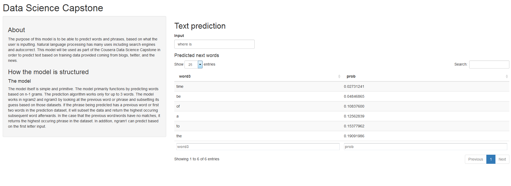

Coursera Data Science Capstone
========================================================
author: dchen71
date: 05/12/2016

About Natural Language Processing
========================================================

Natural language processing(NLP) is a field dedicated to understanding the interactions between computers and natural languages. NLP has it's roots in trying to help model the characteristics that we take for granted in speech and text, and to be able to parse and created meaning for the compiler. 

Some of the practical uses include the following:
* Summarization
* Machne Translation
* Text prediction

The goal of the model is to be to be able to predict the next word that will be input, when typing.

The model
========================================================

## Preprocessing
Datasets came from twitter, blogs and news. They were processed to remove extra spaces, swears, and punctuation and set up into 1-grams(single word), 2-grams(two word phrases such as "where are"), and 3-grams(three word phrases such as "where are the"). 

## Model
The model is based on Katz Backoff model. For n-1 grams, the prediction is based on the occurence of the word before in the training text. The model should become better with increased training data and word combinations and can be improved with predictions based on text input as well.

Model Performance
========================================================

Preprocessing takes a while due to the sheer number of words and data to process but the model itself runs pretty quickly. It's built using 400,000 pieces of data from all three datasets and taking about 99.5% of words and phrases that occur when preprocessing the n-grams. The data was further processed in a manner which takes the total number of occurences of a word or phrase. The algorithm is directly using the preprocessed data. The algorithm with primarily built using simple nested if conditions based on number of words. 

The model in action
========================================================

