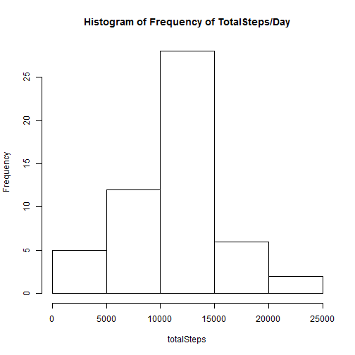
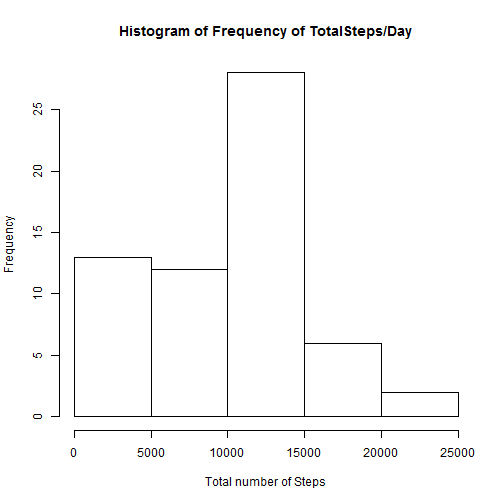

###Introduction

It is now possible to collect a large amount of data about personal movement using activity monitoring devices such as a Fitbit, Nike Fuelband, or Jawbone Up. These type of devices are part of the "quantified self" movement -- a group of enthusiasts who take measurements about themselves regularly to improve their health, to find patterns in their behavior, or because they are tech geeks. But these data remain under-utilized both because the raw data are hard to obtain and there is a lack of statistical methods and software for processing and interpreting the data.

This assignment makes use of data from a personal activity monitoring device. This device collects data at 5 minute intervals through out the day. The data consists of two months of data from an anonymous individual collected during the months of October and November, 2012 and include the number of steps taken in 5 minute intervals each day.

###Loading and preprocessing the data
This part of the code is necessary for the inital loading of the dataset

```r
    #Reads the data
    data = read.csv('activity.csv')
    data$date = as.Date(data$date, "%Y-%m-%d")
    #Splits the data per date
    splitDay = split(data, data$date)
```

###What is mean total number of steps taken per day?


```r
    #Total number of steps/Median per day
    totalSteps = sapply(splitDay, function(x) sum(x$steps))
    medianSteps = sapply(splitDay, function(x) median(x$steps))
    hist(totalSteps,main="Histogram of Frequency of TotalSteps/Day")
```

 
  
Total number of steps/day

```
## 2012-10-01 2012-10-02 2012-10-03 2012-10-04 2012-10-05 2012-10-06 
##         NA        126      11352      12116      13294      15420 
## 2012-10-07 2012-10-08 2012-10-09 2012-10-10 2012-10-11 2012-10-12 
##      11015         NA      12811       9900      10304      17382 
## 2012-10-13 2012-10-14 2012-10-15 2012-10-16 2012-10-17 2012-10-18 
##      12426      15098      10139      15084      13452      10056 
## 2012-10-19 2012-10-20 2012-10-21 2012-10-22 2012-10-23 2012-10-24 
##      11829      10395       8821      13460       8918       8355 
## 2012-10-25 2012-10-26 2012-10-27 2012-10-28 2012-10-29 2012-10-30 
##       2492       6778      10119      11458       5018       9819 
## 2012-10-31 2012-11-01 2012-11-02 2012-11-03 2012-11-04 2012-11-05 
##      15414         NA      10600      10571         NA      10439 
## 2012-11-06 2012-11-07 2012-11-08 2012-11-09 2012-11-10 2012-11-11 
##       8334      12883       3219         NA         NA      12608 
## 2012-11-12 2012-11-13 2012-11-14 2012-11-15 2012-11-16 2012-11-17 
##      10765       7336         NA         41       5441      14339 
## 2012-11-18 2012-11-19 2012-11-20 2012-11-21 2012-11-22 2012-11-23 
##      15110       8841       4472      12787      20427      21194 
## 2012-11-24 2012-11-25 2012-11-26 2012-11-27 2012-11-28 2012-11-29 
##      14478      11834      11162      13646      10183       7047 
## 2012-11-30 
##         NA
```
  
Median number of steps/day

```
## 2012-10-01 2012-10-02 2012-10-03 2012-10-04 2012-10-05 2012-10-06 
##         NA          0          0          0          0          0 
## 2012-10-07 2012-10-08 2012-10-09 2012-10-10 2012-10-11 2012-10-12 
##          0         NA          0          0          0          0 
## 2012-10-13 2012-10-14 2012-10-15 2012-10-16 2012-10-17 2012-10-18 
##          0          0          0          0          0          0 
## 2012-10-19 2012-10-20 2012-10-21 2012-10-22 2012-10-23 2012-10-24 
##          0          0          0          0          0          0 
## 2012-10-25 2012-10-26 2012-10-27 2012-10-28 2012-10-29 2012-10-30 
##          0          0          0          0          0          0 
## 2012-10-31 2012-11-01 2012-11-02 2012-11-03 2012-11-04 2012-11-05 
##          0         NA          0          0         NA          0 
## 2012-11-06 2012-11-07 2012-11-08 2012-11-09 2012-11-10 2012-11-11 
##          0          0          0         NA         NA          0 
## 2012-11-12 2012-11-13 2012-11-14 2012-11-15 2012-11-16 2012-11-17 
##          0          0         NA          0          0          0 
## 2012-11-18 2012-11-19 2012-11-20 2012-11-21 2012-11-22 2012-11-23 
##          0          0          0          0          0          0 
## 2012-11-24 2012-11-25 2012-11-26 2012-11-27 2012-11-28 2012-11-29 
##          0          0          0          0          0          0 
## 2012-11-30 
##         NA
```
  
###What is the average daily activity pattern?
The code initializes the dataset and creates a plot to find the average steps vs time interval

```r
    #Preallocate vector
    interval = seq(0,2355,5)
    steps = numeric()
    for(i in 1:472) {
        steps[i] = 0
    }
    avgSteps = data.frame(interval, steps)
    names(avgSteps) = c('interval','avgsteps')
    
    #Adds the mean data in for the 5 minute interval
    for (i in 1:472){
        avgSteps$avgsteps[i] = mean(data$steps[data$interval == interval[i]], na.rm=TRUE)
    }
    
    #Plots the avgsteps vs time interval
    plot(avgSteps, type='l', main='Avg. Steps over 5 minute intervals',xlab='Interval(minutes)',
         ylab='Average Steps')
```

 

```r
    #Finds the interval with the highest avg
    avgSteps$interval[which.max(avgSteps$avgsteps)]
```

```
## [1] 835
```
  
The interval with the highest average is 835  

##Imputing missing values


```r
    #Counts number of na values in steps
    numNa = sum(is.na(data$steps))
```
  
The number of NA values in the dataset is 2304
  
All NA values will be replaced with 0


```r
    #Replaces NA with 0
    noNa = data
    noNa[is.na(noNa)]=0
    #Splits the data per date
    splitNa = split(noNa, noNa$date)
    #Average steps/median
    totalNa = sapply(splitNa, function(x) sum(x$steps))
    #Plots histogram of the number of total steps per day
    hist(totalNa,main="Histogram of Frequency of TotalSteps/Day", xlab="Total number of Steps")
```

 

```r
    #Average/mean across all values
    avgNa = sapply(splitNa, function(x) mean(x$steps))
    medNa = sapply(splitNa, function(x) median(x$steps))
```
  
The following is the adjusted average values after changing all NA values to 0

```
## 2012-10-01 2012-10-02 2012-10-03 2012-10-04 2012-10-05 2012-10-06 
##  0.0000000  0.4375000 39.4166667 42.0694444 46.1597222 53.5416667 
## 2012-10-07 2012-10-08 2012-10-09 2012-10-10 2012-10-11 2012-10-12 
## 38.2465278  0.0000000 44.4826389 34.3750000 35.7777778 60.3541667 
## 2012-10-13 2012-10-14 2012-10-15 2012-10-16 2012-10-17 2012-10-18 
## 43.1458333 52.4236111 35.2048611 52.3750000 46.7083333 34.9166667 
## 2012-10-19 2012-10-20 2012-10-21 2012-10-22 2012-10-23 2012-10-24 
## 41.0729167 36.0937500 30.6284722 46.7361111 30.9652778 29.0104167 
## 2012-10-25 2012-10-26 2012-10-27 2012-10-28 2012-10-29 2012-10-30 
##  8.6527778 23.5347222 35.1354167 39.7847222 17.4236111 34.0937500 
## 2012-10-31 2012-11-01 2012-11-02 2012-11-03 2012-11-04 2012-11-05 
## 53.5208333  0.0000000 36.8055556 36.7048611  0.0000000 36.2465278 
## 2012-11-06 2012-11-07 2012-11-08 2012-11-09 2012-11-10 2012-11-11 
## 28.9375000 44.7326389 11.1770833  0.0000000  0.0000000 43.7777778 
## 2012-11-12 2012-11-13 2012-11-14 2012-11-15 2012-11-16 2012-11-17 
## 37.3784722 25.4722222  0.0000000  0.1423611 18.8923611 49.7881944 
## 2012-11-18 2012-11-19 2012-11-20 2012-11-21 2012-11-22 2012-11-23 
## 52.4652778 30.6979167 15.5277778 44.3993056 70.9270833 73.5902778 
## 2012-11-24 2012-11-25 2012-11-26 2012-11-27 2012-11-28 2012-11-29 
## 50.2708333 41.0902778 38.7569444 47.3819444 35.3576389 24.4687500 
## 2012-11-30 
##  0.0000000
```
  
The following is the adjusted median values after chaning all NA values to 0

```
## 2012-10-01 2012-10-02 2012-10-03 2012-10-04 2012-10-05 2012-10-06 
##          0          0          0          0          0          0 
## 2012-10-07 2012-10-08 2012-10-09 2012-10-10 2012-10-11 2012-10-12 
##          0          0          0          0          0          0 
## 2012-10-13 2012-10-14 2012-10-15 2012-10-16 2012-10-17 2012-10-18 
##          0          0          0          0          0          0 
## 2012-10-19 2012-10-20 2012-10-21 2012-10-22 2012-10-23 2012-10-24 
##          0          0          0          0          0          0 
## 2012-10-25 2012-10-26 2012-10-27 2012-10-28 2012-10-29 2012-10-30 
##          0          0          0          0          0          0 
## 2012-10-31 2012-11-01 2012-11-02 2012-11-03 2012-11-04 2012-11-05 
##          0          0          0          0          0          0 
## 2012-11-06 2012-11-07 2012-11-08 2012-11-09 2012-11-10 2012-11-11 
##          0          0          0          0          0          0 
## 2012-11-12 2012-11-13 2012-11-14 2012-11-15 2012-11-16 2012-11-17 
##          0          0          0          0          0          0 
## 2012-11-18 2012-11-19 2012-11-20 2012-11-21 2012-11-22 2012-11-23 
##          0          0          0          0          0          0 
## 2012-11-24 2012-11-25 2012-11-26 2012-11-27 2012-11-28 2012-11-29 
##          0          0          0          0          0          0 
## 2012-11-30 
##          0
```

###Are there differences in activity patterns between weekdays and weekends?

The following creates subsets containing the weekday/weekend values of the dataset  

```r
    #Shows data of weekday and weekend values
    weekData = data
    weekData[is.na(weekData)]=0    
    weekData$days = weekdays(weekData$date)
    weekData$days = as.factor(ifelse(weekdays(weekData$date) %in% c("Saturday","Sunday"), 
                                      "Weekend", "Weekday")) 

    avgEnd = mean(weekData$steps[weekData$days == 'Weekend'])
    avgDay = mean(weekData$steps[weekData$days == 'Weekday'])

    #Subset weekday and weekend values
    weekdays = subset(weekData, weekData$days == 'Weekday')
    weekends = subset(weekData, weekData$days == 'Weekend')
    
    #Preallocate vector
    weekend = numeric()
    weekday = numeric()
    for(i in 1:472) {
        weekday[i] = 0
        weekend[i] = 0
    }
    avgWeek = data.frame(interval, weekend, weekday)
    names(avgWeek) = c('interval','avgsteps.weekend','avgsteps.weekday')
    
    #Adds the mean data in for the 5 minute interval
    for (i in 1:472){
        avgWeek$avgsteps.weekday[i] = mean(weekdays$steps[weekdays$interval == interval[i]], na.rm=TRUE)
        avgWeek$avgsteps.weekend[i] = mean(weekends$steps[weekends$interval == interval[i]], na.rm=TRUE)
    }
```
  The plot is setup to show the differences in the average steps vs time period between weekends and weekdays

```r
    #Creates the plots
    par(mfrow=c(2,1))
    plot(avgWeek$interval, avgWeek$avgsteps.weekend, type='l', main ="Weekend vs Avg Steps",
         xlab="Interval(steps)", ylab="Average Steps")
    plot(avgWeek$interval, avgWeek$avgsteps.weekday, main ="Weekday vs Avg Steps", 
         xlab="Interval(steps)", ylab="Average Steps", type='l')
```

 
